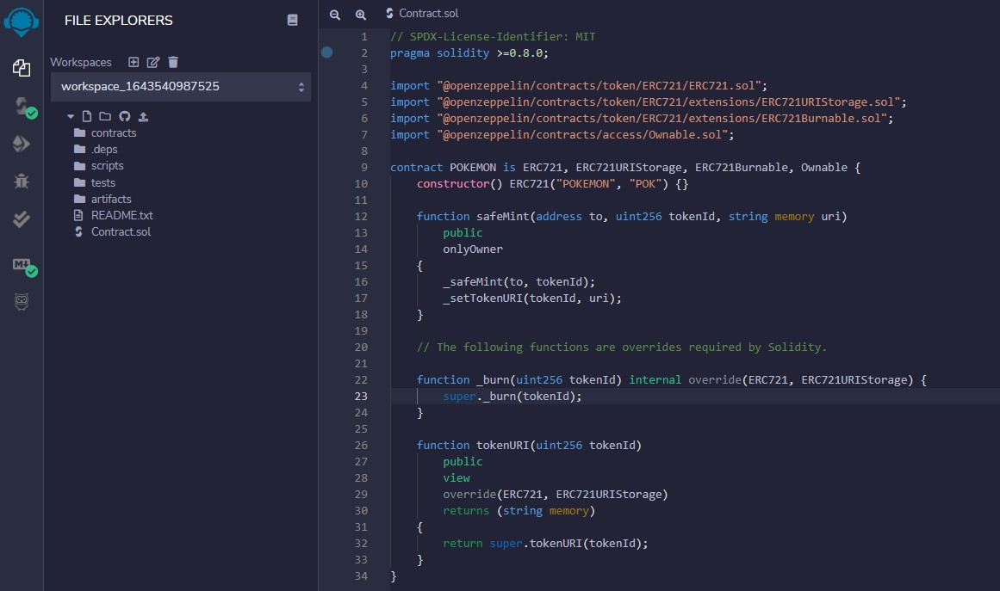
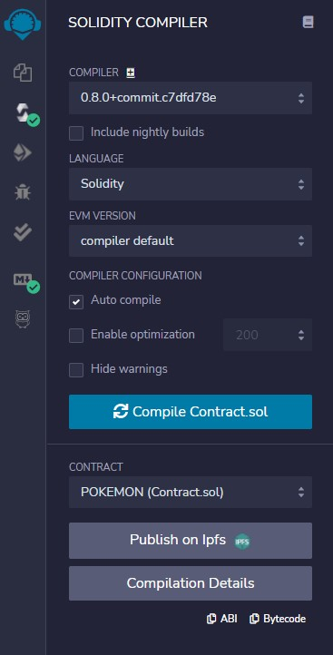
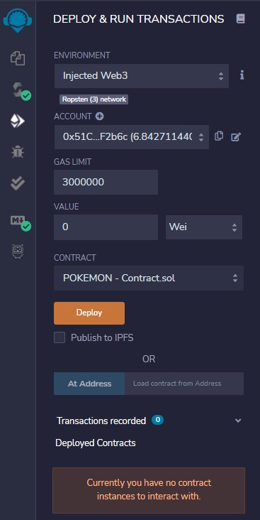

# ERC721 NFT Token Contract
[](https://opensource.org/licenses/MIT)

## Objective

Create a [ERC-721](http://erc721.org/) NFT smart contract and "Retrieve" a "Digital Asset" by its "Token ID".

The contract should cover the following functionality:

* Minting (Creation)
* Ownable
* Burnable
* Metadata Storage

## Initialize a development project in Remix IDE
1. Open [Remix IDE](https://remix.ethereum.org/) in Web Browser.
2. Create a ```Contract.sol``` file inside your Workspace.
3. Copy & Paste the code from [Burple_Contract-Templates](https://github.com/sarangBurpGod/Burple_Contract-Templates/blob/main/ERC721TokenContract.sol) Public Repo.

<p align="center">
  
</p>

## Compile
- Solidity Compiler Plugin - Make sure, code compiles successfully without any errors.

<p align="center">
  
</p>

## Deploy using Ropsten Testnet
1. Deploy & Run Plugin - Select Injected Web3 Environment.
   1. Confirm, your Metamask wallet is connected.
2. Select ```POKEMON - Contract.sol``` from the Contract dropdown.

<p align="center">
  
</p>

3. Click on the **Deploy** button.
4. Confirm the Contract Deployment Transaction (Which will popup on your Metamask Wallet).


## Minting your NFT